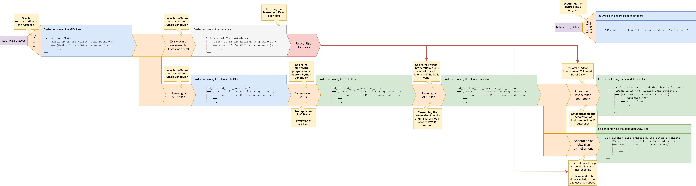

# 1. Dataset Overview

## 1.1 Exploration Phase

During the exploration phase of music datasets in **MIDI format**, we found that while many MIDI collections exist, only a few are of sufficient quality.
Some datasets contained overly simple pieces (e.g., single-instrument tracks, short jingles rather than full songs, or collections restricted to a single genre). Others were **AI-generated**, meaning they would only allow us to reproduce existing model behavior rather than study real musical structure. Some were simply **too small** to be useful for training robust models.

We also considered scraping various websites, but the **heterogeneity of user contributions**, such as non-standardized file names, missing or inconsistent metadata (title, genre, etc.), made large-scale automation impractical.

---

## 1.2 Selected Dataset

Among the datasets explored, one stood out: the **Lakh MIDI Dataset (LMD)**.
This dataset contains **116 189** musical pieces in MIDI format (**Musical Instrument Digital Interface**). MIDI is a compact symbolic representation that encodes musical instructions, such as notes, durations, velocities, and other musical events, rather than raw audio.
Each MIDI file typically contains **multiple tracks (channels)**, each corresponding to a distinct instrument (piano, guitar, drums, etc.). These tracks can be isolated to obtain per-instrument sequences, enabling a deeper structural analysis of a song.

A key feature of LMD is that it is **linked to the Million Song Dataset (MSD)** through a common identifier (`track_id`).

The **Million Song Dataset** is a large open collection of **audio features and metadata** (titles, artists, and especially genres) for one million contemporary songs. It was developed by **The Echo Nest** and **LabROSA**, with funding from the **National Science Foundation**. Its final update was on **April 25, 2012**, after which [The Echo Nest](https://en.wikipedia.org/wiki/The_Echo_Nest) was acquired by **Spotify**.

We further enriched these data using four **genre-classification datasets** associated with MSD tracks:

* **Tagtraum**
* **MAGD**
* **MASD**
* **topMAGD**

After intersecting and filtering all sources, we retained **16 110 songs** with both MIDI files and valid **genre metadata**.
Each song may have several **arrangements (versions)** in MIDI form, and for each we know both the **genre** and **instrumentation**.
This alignment between MIDI content and metadata allows access to musical genres and other attributes, which are central to our study.

To facilitate machine-learning processing, we converted the MIDI files into **ABC notation** (a textual, human-readable representation of musical scores).
This conversion enables more efficient data handling while preserving essential musical information (notes, rhythm, measures).
Each MIDI channel (representing one instrument) is converted into a **separate ABC file**, so that each ABC file corresponds precisely to a specific instrument in a given song.

---

## 1.3 Data Preprocessing Pipeline

The **data-preprocessing pipeline** converts the **Lakh MIDI Dataset (Matched with MSD)** (31 034 songs and 116 189 arrangements) into **ABC files**.
It consists of **seven main stages**, each performing a specific transformation.
An explanatory diagram of the full pipeline was also produced:



---

### 1.3.1 Flattening

The first step organizes the raw MIDI files into a **consistent directory structure**.
This unified layout simplifies batch processing and subsequent analysis.

---

### 1.3.2 Metadata Generation

Before conversion to ABC, we extract **instrument information** (names and corresponding tracks) because the ABC format does **not retain instrument identities**.
To accomplish this, we built a **Python scheduler** that launches multiple **MuseScore** instances in parallel.
For each MIDI file, it produces a **JSON file** containing metadata, especially the `parts` section, which maps instruments to score lines.

This metadata generation process takes about **18 hours** using **two 28-core processors (112 threads)**, meaning 112 MuseScore instances run concurrently.

---

### 1.3.3 MIDI Cleaning

Originally, this step was not planned, since `midi2abc` theoretically converts MIDI to ABC directly.
However, conversion quality depends heavily on **rhythmic alignment**: MIDI stores precise event timestamps ("ticks") that often need quantization to standard musical notation, especially for **human-recorded performances**.
In practice, `midi2abc` fails on certain MIDI standard variants, whereas **MuseScore** handles them far more reliably.
Therefore, a **MIDI-cleaning step** was added, similar in design to the metadata-generation phase.

---

### 1.3.4 MIDI to ABC Conversion

This stage uses the scheduler to apply **`midi2abc`** to all cleaned MIDI files.
Specific arguments are used to **transpose all music to C major**, standardize the **key signature**, and format the output for later **tokenization**.

---

### 1.3.5 ABC Cleaning

Next, **music21** validates the ABC files, checking criteria such as whether the **number of voices** matches the MuseScore-generated metadata (allowing for cases where one instrument plays multiple voices).
Invalid ABCs trigger a **retry**: `midi2abc` is rerun from the **original, uncleaned MIDI**, occasionally recovering additional usable files.

---

### 1.3.6 Track (Voice) Separation

Here, each ABC file is **split into one file per voice**.
This improves readability and enables playback using tools like **Starbound Composer** (or any compatible ABC player).

---

### 1.3.7 ABC Tokenization

In this step, **music21** parses each ABC file into tokens.
A filter keeps only **musically relevant symbols** (e.g., notes, durations, barlines, chord delimiters), ignoring ornaments such as ties.

Each voice is linked to its **MIDI instrument** using MuseScore metadata and `midi2abc` meta-events.
Instruments are grouped into **16 categories**:

> Piano, Organ, Guitar, Bass, String, Vocal, Brass, Reed, Pipe, Synth Lead, Synth Pad, Synth Effect, Pitched Percussion, Percussive, Sound Effect, and Percussion Channel.

Here is the complete set of tokens:

```python
{
    0.5, 0.25, 2.0, 0.375, 0.125, 3.0, 1.0, 0.75, 1.5, 4.0, 
    6.0, 0.1875, 0.0625, 'An7', 12.0, 8.0, 16.0, 'D#-1',
    'G2', 24.0, 'F3', 'F-1', 32.0, 'F2', 'Dn7', 'C8', 'B6',
    'E5', 'E1', 'Cn7', 'D#3', 48.0, 'E-1', 'E4', 'Fn8',
    'C#9', 'D#5', 'Cn3', 'Gn8', 64.0, 'G9', 'An0', 'D6',
    'Gn-1', 'Fn5', 'F1', 'C#1', 'An1', 'G#5', 'A#-1', 'Fn4',
    'An6', 'F8', 'Gn2', 'Fn3', 'F4', 'G5', 'D#0', 'F#9',
    'C#2', 'A#3', 'F0', 'E3', 'Gn5', 'A#5', 'G3', 'D#2',
    'Gn0', 'Dn1', 'Dn6', 'D#1', 'G1', 'Dn5', ']', 'Gn9',
    'Cn4', 'D3', 'C3', 'F6', 'Cn9', 'F#0', 'D#8', 'C0',
    'Cn1', 'C#5', 'Gn6', 'An5', 'G#6', 'B8', 'G#3', 'G8',
    'C2', 'An4','F#2', 'B1', 'C#3', 'F#6', 'D-1', 'Dn-1',
    'B4', 'G#7', 'G7', 'F#8', 'G#2', 'E9', 'F7', 'G#8',
    'Cn2', 'G#0', 'Fn0', 'D#7', 'Fn2', 'B-1', 'F#7', 'D8',
    'Dn3', 'Fn6', 'A4', 'A7',  'C#8', 'Cn8', 'D7', 'B7', 
    'Fn9', 'G#1', 'C#-1', 'F5', 'A1', 'C#6', 'Gn4', 'An-1',
    'An2', 'B3', 'D5', 'C#0', 'A0', 'A#8', 'Dn9', 'A6', 'G4',
    'B0', 'E0', 'Cn5', 'G-1', 'z', 'F#3', 'D#4', 'C5', 'A#6',
    'G6', 'Gn3', 'Dn0', 'Gn7', 'Fn7', 'F#-1', 'A#2', 'Gn1',
    'A8', 'F#5', 'A#1', 'D4', 'C4', 'A-1', 'A3', 'F#1', 
    'A#7', 'B5', 'C#7', '|', 'B2', 'Dn8', 'Cn0', 'A2', 'D#9',
    'D0', 'C#4', 'F#4', 'G#4', 'F9', '[', 'A5', 'Cn-1', 'E7',
    'An8', 'D9', 'C9', 'A#4', 'C-1', 'Dn4', 'G#-1', 'E6', 
    'Fn1', 'C6', 'C7', 'E8', 'Dn2', 'An3', 'C1', 'Fn-1', 
    'D#6', 'E2', 'G0', 'D2', 'D1', 'A#0', 'Cn6'
}
```

**Token definitions:**

* `[` : start of a chord
* `]` : end of a chord
* `|` : barline
* Floating-point numbers: note durations in quarter-time units
* Notes follow the format `{note}{accidental}{octave}`, where `#` = sharp, `-` = flat, `n` = natural.

---

### 1.3.8 Complete Preprocessing Pipeline

After executing all stages, the entire **Lakh MIDI Dataset (Matched)** is available in **cleaned, normalized, tokenized ABC** format.

We then merged and rebalanced the **genre datasets** to ensure class homogeneity.
Sub-genres were grouped into broader categories. For instance, *Hard Rock* and *Contemporary Rock* were both classified under **Rock**.

Here is the final categorization:
```json
{
    "Rock": [
        "Rock",
        "Rock_Contemporary",
        "Rock_Hard",
        "Rock_College",
        "Rock_Alternative",
        "Rock_Neo_Psychedelia",
        "Grunge_Emo",
        "Punk",
        "Pop_Rock",
        "Metal",
        "Metal_Alternative",
        "Metal_Heavy",
        "Metal_Death"
    ],
    "Pop": [
        "Pop",
        "Pop_Contemporary",
        "Pop_Indie",
        "Pop_Latin",
        "Pop_Rock"
    ],
    "Electronic": [
        "Electronic",
        "Dance",
        "Electronica",
        "Experimental"
    ],
    "Country": [
        "Country",
        "Country_Traditional",
        "Folk",
        "Folk_International"
    ],
    "RnB": [
        "Rap",
        "Hip_Hop_Rap",
        "RnB",
        "RnB_Soul"
    ],
    "Jazz": [
        "Jazz",
        "Jazz_Classic",
        "Blues",
        "Blues_Contemporary",
        "Big_Band",
        "Vocal"
    ],
    "World": [
        "International",
        "Latin",
        "Reggae",
        "World"
    ],
    "Other": [
        "Classical",
        "Avant_Garde",
        "Stage",
        "Children",
        "Comedy_Spoken",
        "Holiday",
        "Religious",
        "Gospel",
        "New_Age",
        "Easy_Listening"
    ]
}
```

The final dataset contains **8 main musical genres**:

| Genre      | Number of Songs |
| :--------- | --------------: |
| Pop        |            4883 |
| Rock       |            4507 |
| Electronic |            1817 |
| Country    |            1359 |
| RnB        |            1094 |
| World      |            1062 |
| Jazz       |             810 |
| Other      |             578 |

> Counts refer to **songs (folders)**, not the number of arrangements (files) or instrumental voices.

Each resulting **ABC file** therefore represents a **single musical staff** (an instrument within a song), associated with a **musical genre** (from MSD) and an **instrument category** (from MIDI metadata).

